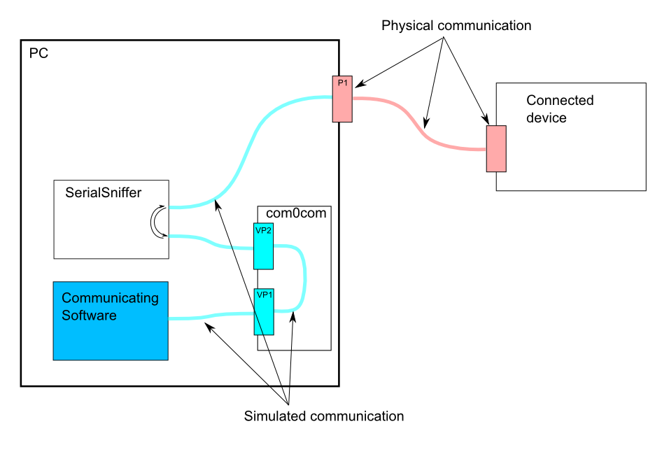

# SerialSniffer

A serial sniffer sits between two devices communicating through a serial channel, typically RS232C, that reads all the data interchanged 
between the devices. In this version, one of the devices must be a PC running .NET, typically a PC under Windows.

This solution relies on the well known **com0com** open source signed device driver available [here](http://com0com.sourceforge.net/).
that creates a virtual "null-modem" connection between two virtual serial ports on the PC. 

So the situation is as follows:

1. **com0com** installs two virtual ports **VP1** and **VP2** internally connected each other
2. The **Communicating Software**, that normally talks to the **Connected device** through a real **COM** port, is programmed to use the virtual port **VP1** instead
3. The **SerialSniffer** is connnected both to the virtual port **VP1** and to the real port **P1**.
   It relays all the data flowing in both directions. All data arriving from **VP1** are transmitted to **P1**, all data arriving from **P1** are transmitted to **VP1**.
   Additionally, it stores this data into a log file.
   
Note
____

Download and use **com0com** version [2.2.2.0](https://sourceforge.net/projects/com0com/files/com0com/2.2.2.0/) as it is signed and works with any Windows version.
Version 3.0 is not working properly.
